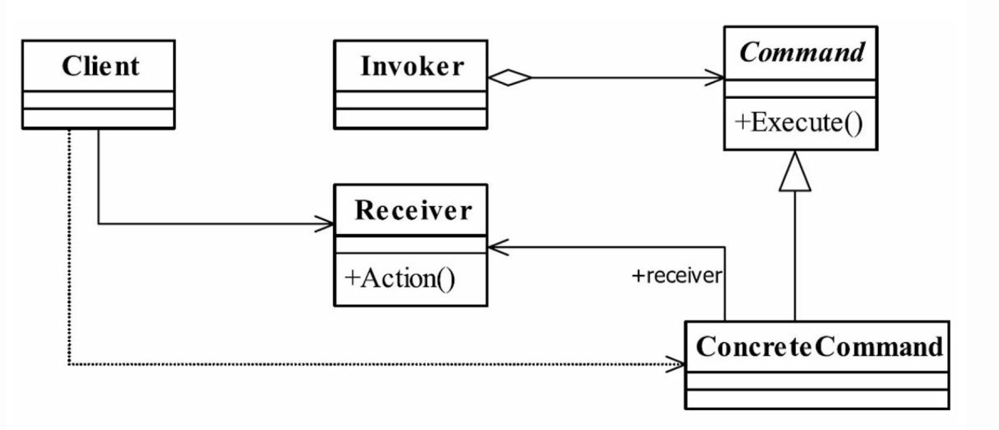
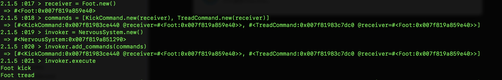

# 设计模式-命令（行为)

## 释义
将请求封装成命令对象，请求的具体执行由命令接收者执行
## UML

## ruby实现

```ruby
class NervousSystem
  attr_accessor :command_queue

  def add_commands(commands = [])
    @command_queue = commands
  end

  def execute(commands = [])
    @command_queue.each { |_command| _command.execute }
  end
end

class Command
  def execute
  end
end

class KickCommand < Command
  attr_accessor :receiver

  def initialize(receiver)
    @receiver = receiver
  end

  def execute
    @receiver.kick
  end
end

class TreadCommand < Command
  attr_accessor :receiver

  def initialize(receiver)
    @receiver = receiver
  end

  def execute
    @receiver.tread
  end
end

class Foot
  def kick
    puts 'Foot kick'
  end

  def tread
    puts 'Foot tread'
  end
end

```
## 调用

