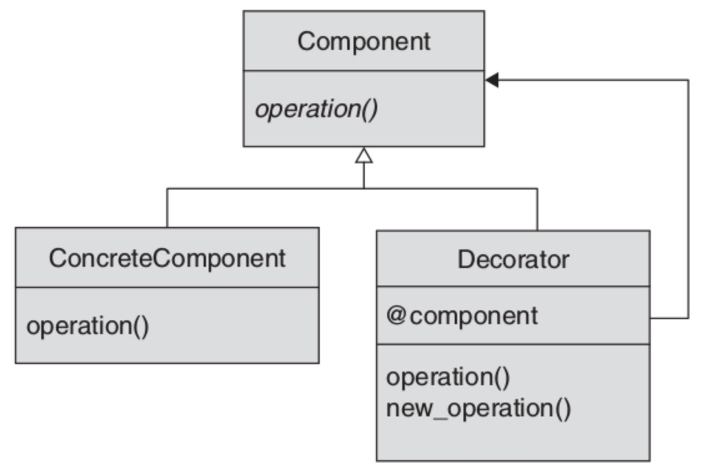
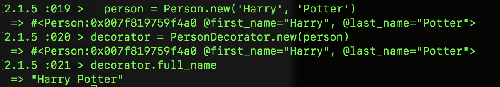

# 设计模式-装饰器(结构)
## 释义
不改动原类结构情况下，对现有对象进行功能扩展。
## UML

## ruby实现

```ruby
class Person
  attr_accessor :first_name, :last_name

  def initialize(first_name, last_name)
    @first_name = first_name
    @last_name = last_name
  end
end

class PersonDecorator < SimpleDelegator
  def full_name
    "#{first_name} #{last_name}"
  end
end
```
## 调用

